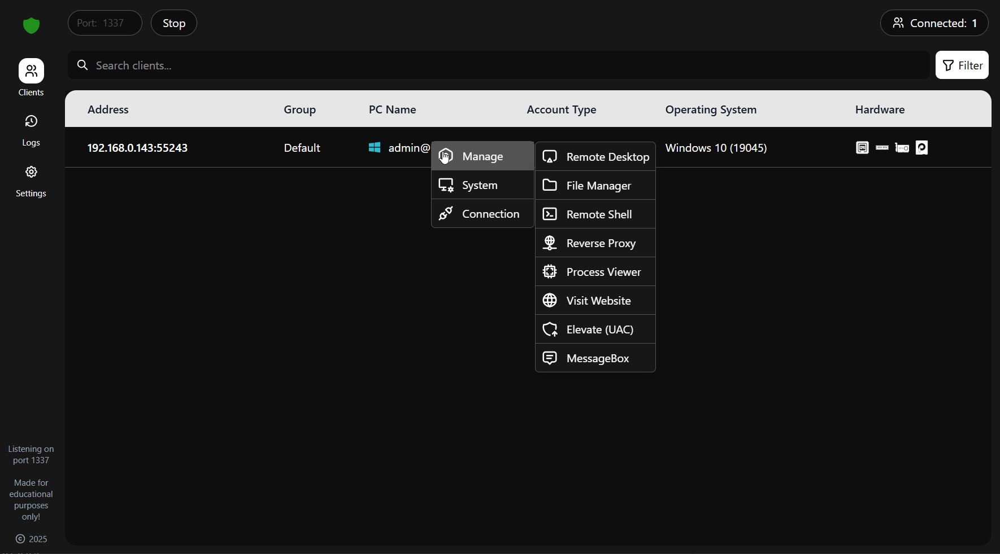

# Rust RAT

  <strong>A Free and Open-Source Remote Administration Tool for Windows, built with Rust.</strong> 
  <em>This project was developed as part of my university thesis during my final year.</em>

---

## ⚠️ Responsible Use

  <strong>This tool is intended for system administration, research, and educational purposes.</strong> 
  <em>Please ensure you have proper authorization before connecting to or managing any system.</em>

---

## 🖼️ Screenshots

For more images, see [IMAGES.md](IMAGES.md).

---

## 🔱 Features

- [x] System Information
- [x] Desktop Screenshot
- [x] Webcam Capture
- [ ] HVNC *(in development)*
- [x] Remote Desktop
- [x] File Manager
- [x] Reverse Shell
- [x] Reverse Proxy
- [x] Task Manager
- [x] Website Visit
- [x] UAC Elevation
- [x] Show Message Boxes
- [x] System Control (Shutdown, Restart, Log Out)
- [x] Connection Manager
- [x] Logging
- [x] World Map
- [x] Client Builder (assembly info, installation, anti-VM, icon customization, etc.)
- [ ] More Features Coming Soon!

---

## 🛠️ Building & Contributing

To learn how to build or contribute to this project, please refer to [USERMANUAL.md](USERMANUAL.md).

---

## 📄 License

**Rust RAT** is distributed under the [MIT License](LICENSE).
